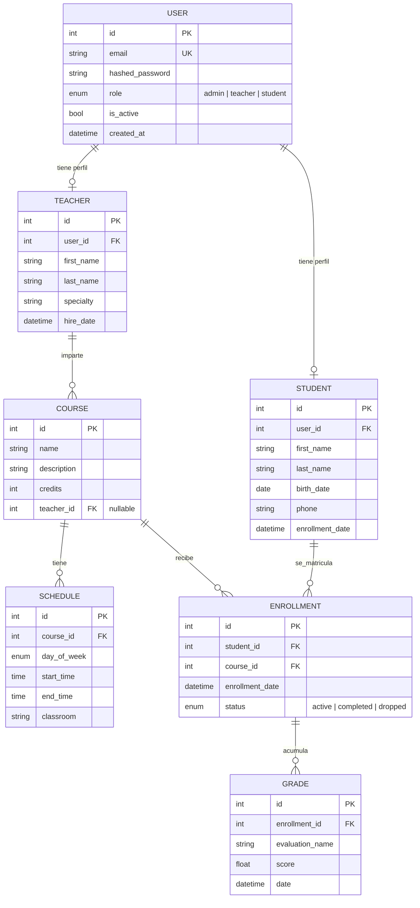

# Diagrama Entidad-Relación — Academia F5

7 tablas, con relaciones 1:1 (`User`↔`Student`, `User`↔`Teacher`), 1:N
(`Teacher`→`Course`, `Course`→`Schedule`, `Enrollment`→`Grade`) y N:M
(`Student`↔`Course` a traves de `Enrollment`).

## Notas de diseno

- **`Enrollment` es la tabla puente** de la relacion N:M entre `Student` y
  `Course`; ademas guarda el `status` de la matricula (activa, completada,
  abandonada), asi que modela tambien un caso de negocio, no solo una
  relacion tecnica.
- Restriccion `UNIQUE(student_id, course_id)` en `enrollments` evita
  matriculas duplicadas a nivel de base de datos (no solo en la capa de
  aplicacion).
- `teacher_id` en `courses` es nullable con `ON DELETE SET NULL`: si se
  borra un profesor, sus cursos no desaparecen, quedan "sin profesor
  asignado".
- El resto de claves foraneas usan `ON DELETE CASCADE` porque no tiene
  sentido conservar horarios, matriculas o notas huerfanas.
- Los modelos (`backend/app/models/`) usan tipos SQL estandar (no
  especificos de PostgreSQL), por lo que el mismo esquema es valido tanto
  en PostgreSQL (produccion) como en SQLite (tests).
